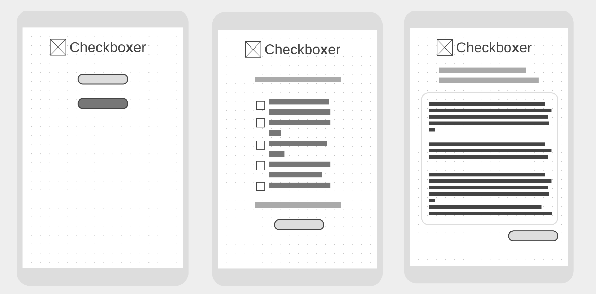

Checkbo**x**er is a webtool built with STEM journal Editors in mind.  Use Checkbo**x**er to speed up submission requirement checks in pre-review.

1. Customise your modular revision template and checklist items in a CSV file
2. Complete the checklist per manuscript
3. Copy and paste the generated text to your email interface where you can personalise your message

### Why Checkbo**x**er?
I've witnessed Journal Editors using paper checklists, struggling to copy and paste paragraphs from a large body of template text.  Checkbo**x**er remedies this system, generating only the text you need, every time.  

- Checkbo**x**er can save Editors _minutes_ for every submission they check!
- Checkbo**x**er lowers the chance of human errors, and makes editorial communication quality more consistent!

## Installation and Set Up

First download the required gems with bundler:
```console
$ bundle install
```

Then you'll need to install a webserver, I've used `thin`:
```console
$ gem install thin
```

**Important**: You will need to customise your CSV file:


## Running the app

Run your webserver then navigate to the `localhose:XXportXX` in your browser.

Eg using `thin` run the command in your terminal then go to `localhost:3000`:
```console
$ thin start
Using rack adapter
Thin web server (v1.7.2 codename Bachmanity)
Maximum connections set to 1024
Listening on 0.0.0.0:3000, CTRL+C to stop
```

## Running the tests

To run all feature and unit tests, use `rspec` in the command line from the project root:
```console
$ rspec

Hello, world!
  index displays hello world

Finished in 0.01611 seconds (files took 0.42259 seconds to load)
1 example, 0 failures
```

To run code style tests, use `rubocop` in the command line from the project root:
```console
$ rubocop
Inspecting 6 files
......

6 files inspected, no offenses detected
```

To run code quality tests, use `rubycritic` in the command line from the project root:
```console
$ rubycritic
running flay smells

running flog smells
.......
running reek smells
.......
running complexity
.......
running attributes
.......
running churn
.......
New critique at file:XXX.html
Score: 96.28
```

## Tech stack

- [Capybara](https://github.com/teamcapybara/capybara) - an acceptance test framework for web applications
- [CSS3](https://developer.mozilla.org/en-US/docs/Archive/CSS3) - a cascading style sheets language
- [eRuby](https://ruby-doc.org/stdlib-2.6.3/libdoc/erb/rdoc/ERB.html) (embedded Ruby) - a templating system for embedding Ruby into a text document
- [HTML5](https://w3.org/html/logo) - an internet document mark-up language
- [RSpec](https://rspec.info/) - a testing DSL for Ruby
- [Rubocop](https://rubocop.readthedocs.io/en/stable/) - a static code analyzer and code formatter
- [RubyCritic](https://github.com/whitesmith/rubycritic) - a code quality analysis tool for Ruby
- [Ruby](https://www.ruby-lang.org/en/) - a dynamic, object oriented programming language
- [SimpleCov](https://github.com/colszowka/simplecov) - a code coverage analysis tool for Ruby
- [Sinatra](http://sinatrarb.com/) - a DSL for creating Ruby web applications
- [Travis CI](https://travis-ci.org/) - a continuous integration platform and deployment manager

## On the To Do list...

- Beautiful styling
- Instructions for customising CSV files
- [Copy to clipboard feature](https://rubygems.org/gems/clipboard/versions/1.3.3)
- [Custom HTTP error handling](http://sinatrarb.com/intro.html#Error%20Handling)
- Improve default template

## Wireframes



## Resources

- [loremipsum.io](https://loremipsum.io/) - a placeholder text generator
- [wireframe.cc](https://wireframe.cc/) - a wireframe tool
- [Learn how to create custom checkboxes and radio buttons with CSS.](https://www.w3schools.com/howto/howto_css_custom_checkbox.asp)
